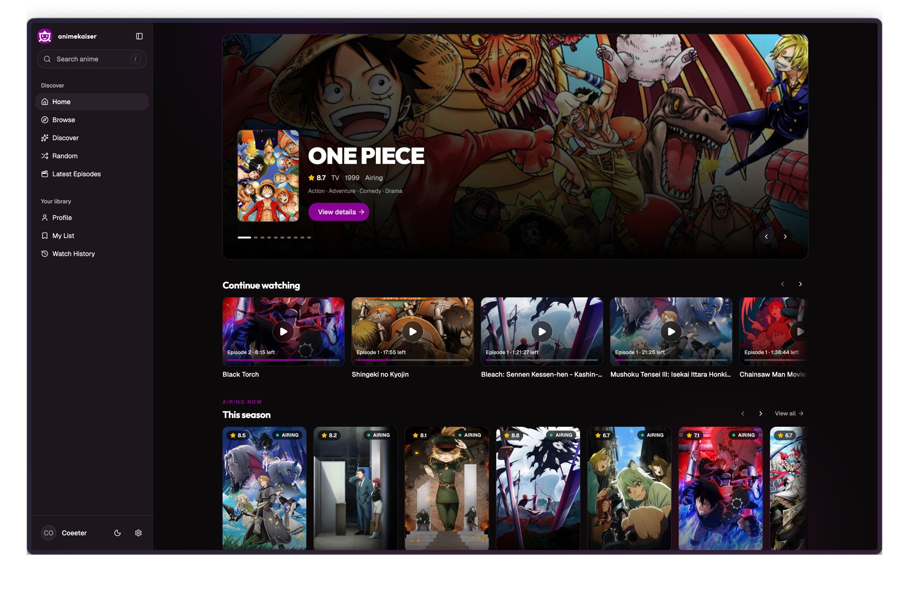
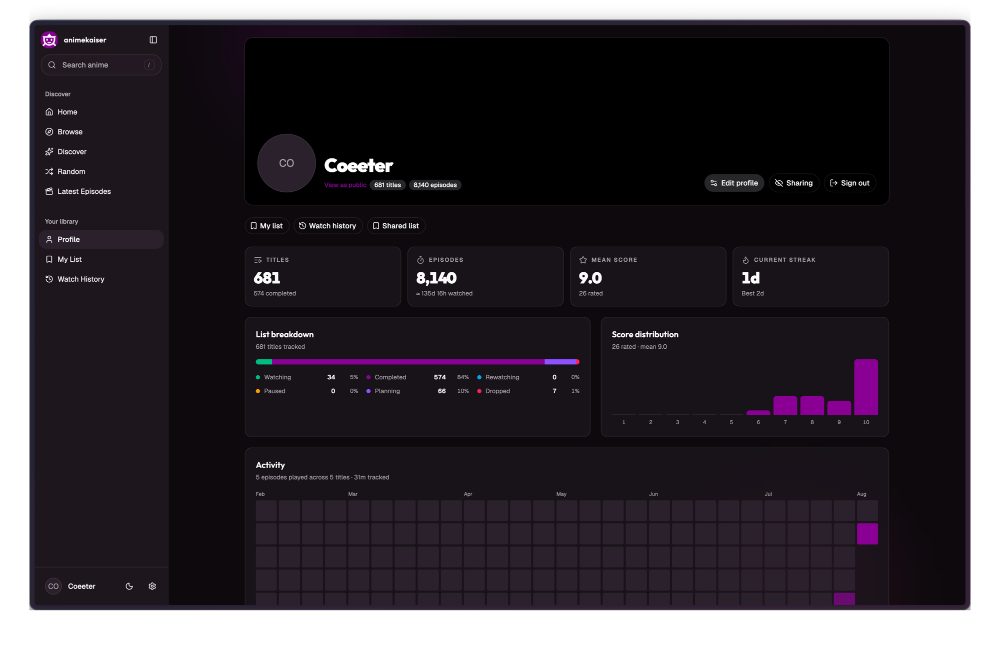
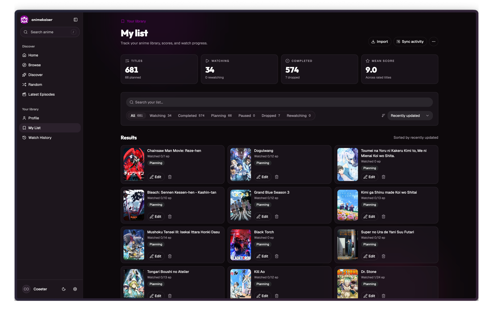
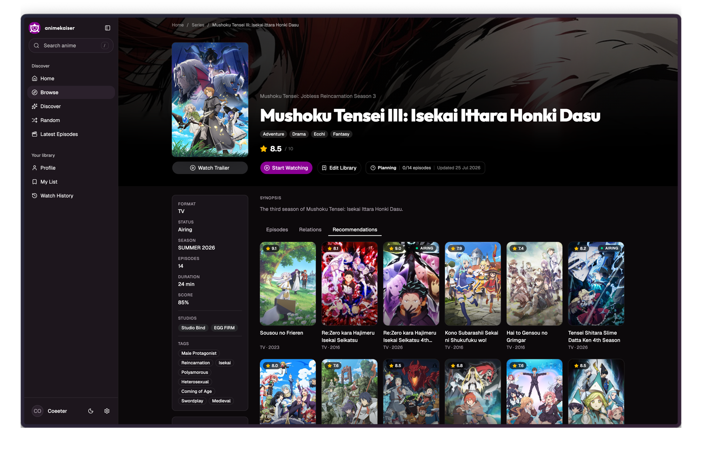

# AnimeKaiser

AnimeKaiser is a self-hosted anime tracker. You get a personal library with
watch status and episode progress, a discovery catalogue pulled from public
anime metadata, and two-way sync with AniList and MyAnimeList. A separate
streaming service resolves playback sources, and whatever you watch gets
recorded back to your library.

**Status:** actively being built, self-hosted only. No hosted instance, no
public deployment. Things move fast here — schema, RPC contracts, whatever —
so don't expect stability between commits yet.

## What it does

**Library management.** Every entry is keyed by MyAnimeList ID and tracks
status, episode count, score, and privacy. Libraries can be public or private,
with profile pages and stats for the public ones.

**Syncing with AniList/MAL.** Link an account over OAuth and AnimeKaiser
imports your existing list once, then pushes local changes back out from then
on. Sync happens through an event log (`library_sync_event` rows worked by a
background job), so a failed sync is visible and retryable instead of quietly
blocking a write. Refresh tokens get rotated by their own worker.

**Discovery.** Browse, search, seasonal schedule, and a "surprise me" endpoint,
backed by AniList's GraphQL API and Jikan (the MAL REST mirror), with Redis
caching in front of both.

**Streaming.** Finding and proxying actual streams is handled by a separate
service that isn't part of this repo. AnimeKaiser only talks to it over a
typed RPC contract (`StreamingClient` in `apps/api/src/infra/streaming.ts`)
and only ever stores the anime-to-provider mappings it hands back — never the
stream data itself, and no provider is hardcoded. Bring your own
implementation and point `STREAMING_SERVICE_URL` / `STREAMING_SECRET` at it.
Without those set, streaming just shows as unavailable — nothing else
breaks.

The web app itself has a player with subtitles and server/audio-track
selection, and watch progress feeds the history and "continue watching" row.

## Architecture

Bun workspaces, orchestrated by Turborepo: two apps, six packages.

### Applications

| Path       | Role                                                                                                                                                                        |
| ---------- | --------------------------------------------------------------------------------------------------------------------------------------------------------------------------- |
| `apps/api` | Backend. Composes the Effect layer graph: Postgres, Redis, Better Auth, R2 media storage, HTTP routes, the RPC server, and three background workers (library import, library sync, token refresh). Entry point is `src/app.ts`. |
| `apps/web` | TanStack Start browser application. File-based routes in `src/routes`, feature modules in `src/features`, state via `effect-atom`. Talks to the API over the RPC WebSocket.   |

### Packages

| Path               | Role                                                                                                                                    |
| ------------------ | --------------------------------------------------------------------------------------------------------------------------------------- |
| `packages/domain`  | Infrastructure-free `effect/Schema` models and `@effect/rpc` contracts. The single shared contract between server and client. `KaiserRpcs` in `src/rpc.ts` merges every RPC group. |
| `packages/db`      | Drizzle schema, migrations, and the `Database` service. Schema is split by concern: `auth`, `profile`, `library`, `external-list-account`, `history`, `streaming`. |
| `packages/core`    | Backend business services — anime metadata, profiles, library import/sync, external-list OAuth, watch history, stream resolution. Depends on `db` and `domain`, never on HTTP composition. |
| `packages/rpc`     | Effect RPC server: handler layers per domain group, plus authentication middleware and request logging. `RpcLive` mounts the group at `/rpc` over WebSocket with NDJSON serialisation. |
| `packages/auth`    | Better Auth server and web client configuration. Auth tables live in `packages/db`.                                                      |
| `packages/ui`      | Shared React components, hooks, and global styles, exported through `components/*` entry points.                                          |

### Request path

The web app calls a typed RPC method from `packages/domain`. That request hits
`packages/rpc`'s handler layer, which resolves a service from `packages/core`,
which reads or writes through `packages/db`. The only things living directly
in `apps/api/src/routes` are HTTP concerns like CORS and auth callbacks.

No separate queue for background work — it's dispatched through Postgres
`LISTEN`/`NOTIFY`, with `DatabaseListenerLive` in
`apps/api/src/infra/database.ts` waking the workers up.

## Tech stack

- **Runtime / tooling:** Bun 1.3.3, Turborepo, TypeScript 7, Biome
- **Backend:** Effect 3, `@effect/platform` HTTP, `@effect/rpc`, Drizzle ORM, Postgres 17, Redis 8
- **Auth:** Better Auth (email/password, passkeys, OAuth account linking)
- **Frontend:** TanStack Start, React 19, TanStack Router, `effect-atom`, Tailwind
- **External services:** AniList GraphQL, Jikan, Resend (transactional email), Cloudflare R2 (profile media)
- **Testing:** `bun test` for unit tests, Playwright for end-to-end

## Local setup

### Prerequisites

- Bun 1.3.3 or newer
- Node.js 20 or newer
- Docker, or a local Postgres 17 and Redis 8

### Steps

```bash
bun install
cp .env.example .env
```

Start Postgres and Redis. The repository ships a compose file for both:

```bash
bun run --cwd packages/db dev     # docker compose up: postgres:17 + redis:8
```

Apply migrations, then start everything:

```bash
bun run --cwd packages/db db:migrate
bun dev
```

The web app serves on `http://localhost:3000`, the API on `http://localhost:8080`.

### Environment variables

All read in `apps/api/src/env.ts`. Anything without a default is required —
the API won't start without it. See `.env.example` for the full list.

| Variable                                    | Notes                                                              |
| ------------------------------------------- | ------------------------------------------------------------------ |
| `DATABASE_URL`, `REDIS_URL`                  | Match the compose file defaults out of the box.                     |
| `PORT`, `ENV`                                | Default to `8080` and `dev`.                                        |
| `APP_URL`, `VITE_API_URL`, `BETTER_AUTH_URL` | Origins for CORS, the client, and auth callbacks.                   |
| `BETTER_AUTH_SECRET`                         | Any high-entropy string. Change it outside development.             |
| `AUTH_COOKIE_DOMAIN`                         | Leave empty on localhost.                                           |
| `MAL_CLIENT_ID` / `MAL_CLIENT_SECRET`        | MyAnimeList OAuth app. Required for MAL sync.                       |
| `ANILIST_CLIENT_ID` / `ANILIST_CLIENT_SECRET`| AniList OAuth app. Required for AniList sync.                       |
| `RESEND_API_KEY`, `AUTH_EMAIL_FROM`          | Verification and password-reset email.                              |
| `R2_*`                                       | S3-compatible bucket for profile media. Any S3-compatible endpoint works. |
| `DISCORD_ALERT_WEBHOOK_URL`                  | Optional. Fatal startup/runtime crashes post here.                  |

## Commands

```bash
bun dev              # All development tasks
bun build            # Build all workspaces
bun typecheck        # Type-check all workspaces
bun lint             # Biome check
bun format           # Biome format --write
bun test             # Unit tests
bun test:e2e         # Playwright end-to-end tests
```

Database:

```bash
bun run --cwd packages/db dev          # Start Postgres + Redis via Docker
bun run --cwd packages/db db:generate  # Generate a migration from schema changes
bun run --cwd packages/db db:migrate   # Apply migrations
bun run --cwd packages/db db:studio    # Drizzle Studio
```

## Tests

Unit tests run under Bun's test runner and need no external services:

```bash
bun test
```

End-to-end tests use Playwright and require a running API, web app, Postgres,
and Redis. Install the browser once, then run:

```bash
bun test:e2e:install
bun test:e2e
```

`KAISER_E2E_PASSWORD` overrides the throwaway account password used by the
onboarding spec.

## Screenshots

**Home** — continue watching, seasonal airing, and discovery rows.



**Profile** — library breakdown, score distribution, and an activity heatmap
derived from watch history.



**My list** — the tracked library with status filters, search, and per-title
progress. Import and sync activity are driven from here.



**Series detail** — metadata, library state, and tabs for episodes, relations,
and recommendations.



## License

[GNU Affero General Public License v3.0](./LICENSE).

If you run a modified version of this software as a network service, the AGPL
requires you to make its source available to that service's users.
